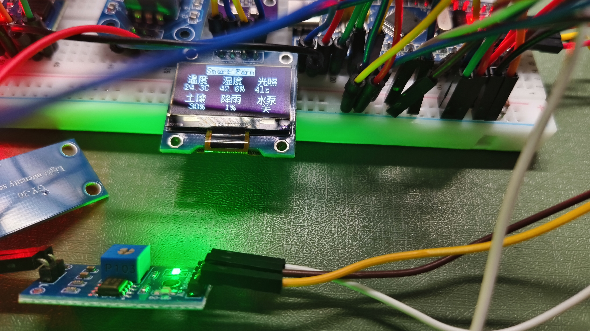
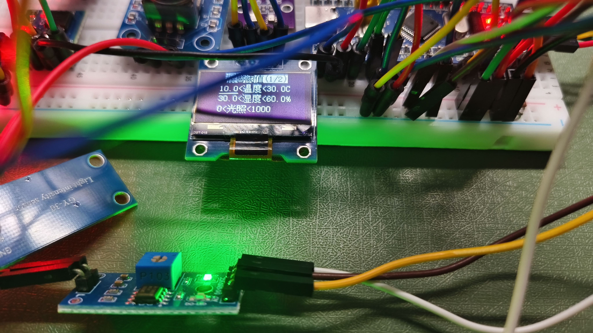
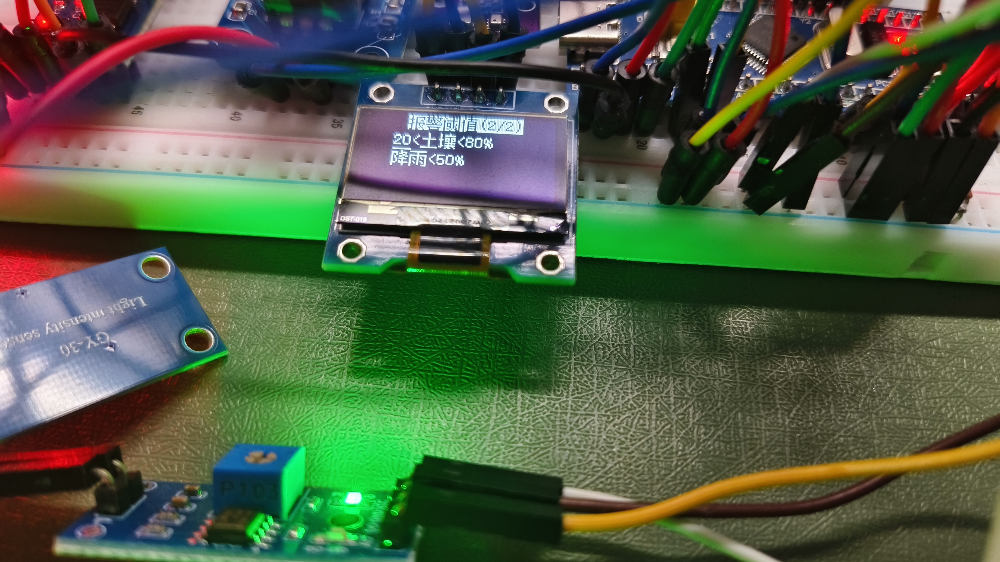
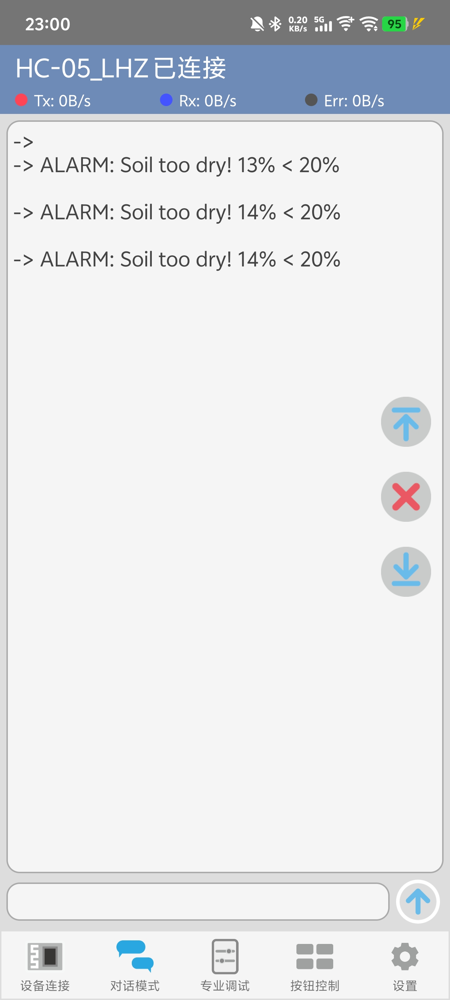

# 智能农场监控系统

## 项目简介

本项目是一个基于GD32F103C8T6微控制器的智能农场监控系统，集成了多种传感器和执行器，实现了对农场环境的实时监测、自动灌溉、异常报警和远程数据传输等功能。系统采用FreeRTOS实时操作系统，通过OLED显示屏实时显示环境数据，支持用户通过编码器和按键进行参数配置，并通过蓝牙模块将报警信息发送到手机。

### 主要功能

- **环境监测**：实时监测温度、湿度、气压、光照强度、土壤湿度和降雨量
- **自动灌溉**：根据土壤湿度自动控制水泵，实现智能灌溉
- **异常报警**：当环境参数超出设定阈值时，通过蜂鸣器和蓝牙报警
- **数据存储**：使用Flash存储用户配置的阈值参数
- **人机交互**：通过OLED显示屏、编码器和按键实现友好的人机交互界面
- **远程通信**：通过蓝牙模块将报警信息发送到手机

---

## 演示视频和图片

### 演示视频

[点击观看演示视频](doc/deno.mp4)

### 界面展示

#### 主页显示


#### 阈值设置页1


#### 阈值设置页2


#### 异常报警显示


---

## 引脚配置

### 主控芯片引脚分配

| 功能模块 | 引脚 | 功能 | 备注 |
|---------|------|------|------|
| **LED指示灯** | PC13 | LED0 | 系统运行指示灯 |
| | PB8 | LED1 | 系统状态指示灯 |
| | PB9 | LED2 | 水泵状态指示灯 |
| **按键输入** | PC14 | KEY1 | 页面切换按键 |
| | PC15 | KEY2 | 编辑模式切换按键 |
| **编码器** | PB0 | 编码器A相 | 旋转编码器A相输入 |
| | PB1 | 编码器B相 | 旋转编码器B相输入 |
| | PA7 | 编码器按键 | 编码器按键输入 |
| **OLED显示屏** | PB6 | OLED_SCL | I2C时钟线 |
| | PB7 | OLED_SDA | I2C数据线 |
| **AHT20温湿度传感器** | PB10 | AHT20_SCL | I2C时钟线 |
| | PB11 | AHT20_SDA | I2C数据线 |
| **BMP280气压传感器** | PB10 | BMP280_SCL | I2C时钟线（与AHT20共用） |
| | PB11 | BMP280_SDA | I2C数据线（与AHT20共用） |
| **BH1750光照传感器** | PA0 | LIGHT_SCL | I2C时钟线 |
| | PA1 | LIGHT_SDA | I2C数据线 |
| **土壤湿度传感器** | PA4 | SOIL_ADC | ADC通道4输入 |
| **降雨量传感器** | PA5 | RAIN_ADC | ADC通道5输入 |
| **蜂鸣器** | PA6 | BUZZER_PWM | PWM输出（TIM2_CH1） |
| **串口通信** | PA9 | USART0_TX | 串口发送引脚 |
| | PA10 | USART0_RX | 串口接收引脚 |
| **蓝牙模块** | PA2 | USART1_TX | 蓝牙模块发送引脚 |
| | PA3 | USART1_RX | 蓝牙模块接收引脚 |
| **W25Q64 Flash存储** | PB12 | W25Q_CS | Flash片选信号 |
| | PB13 | W25Q_CLK | Flash时钟信号 |
| | PB14 | W25Q_MISO | Flash主入从出数据线 |
| | PB15 | W25Q_MOSI | Flash主出从入数据线 |

### 引脚配置说明

#### 1. LED指示灯（3个）
- **LED0 (PC13)**：系统运行指示灯，正常工作时以500ms周期闪烁
- **LED1 (PB8)**：系统状态指示灯，用于显示系统状态
- **LED2 (PB9)**：水泵状态指示灯，点亮表示水泵开启，熄灭表示水泵关闭

#### 2. 按键输入（2个）
- **KEY1 (PC14)**：页面切换按键，用于在主页和阈值页之间切换
- **KEY2 (PC15)**：编辑模式切换按键，用于进入/退出编辑模式

#### 3. 编码器（3个引脚）
- **编码器A相 (PB0)**：旋转编码器A相输入，连接外部中断EXTI0
- **编码器B相 (PB1)**：旋转编码器B相输入，连接外部中断EXTI1
- **编码器按键 (PA7)**：编码器按键输入，用于确认操作

#### 4. OLED显示屏（2个引脚）
- **OLED_SCL (PB6)**：I2C时钟线，用于同步数据传输
- **OLED_SDA (PB7)**：I2C数据线，用于传输显示数据

#### 5. AHT20温湿度传感器（2个引脚）
- **AHT20_SCL (PB10)**：I2C时钟线，用于同步数据传输
- **AHT20_SDA (PB11)**：I2C数据线，用于传输温湿度数据

#### 6. BMP280气压传感器（2个引脚）
- **BMP280_SCL (PB10)**：I2C时钟线，与AHT20共用
- **BMP280_SDA (PB11)**：I2C数据线，与AHT20共用
- **注意**：AHT20和BMP280共用I2C总线，通过不同的I2C地址区分

#### 7. BH1750光照传感器（2个引脚）

- **LIGHT_SCL (PA0)**：I2C时钟线，用于同步数据传输
- **LIGHT_SDA (PA1)**：I2C数据线，用于传输光照数据

#### 8. 土壤湿度传感器（1个引脚）
- **SOIL_ADC (PA4)**：ADC通道4输入，用于采集土壤湿度模拟信号
- **注意**：土壤湿度传感器输出模拟电压，通过ADC转换为数字量

#### 9. 降雨量传感器（1个引脚）
- **RAIN_ADC (PA5)**：ADC通道5输入，用于采集降雨量模拟信号
- **注意**：降雨量传感器输出模拟电压，通过ADC转换为数字量

#### 10. 蜂鸣器（1个引脚）
- **BUZZER_PWM (PA6)**：PWM输出（TIM2_CH1），用于控制蜂鸣器频率和音量
- **注意**：蜂鸣器通过PWM控制，频率可调，音量可调

#### 11. 串口通信（2个引脚）
- **USART0_TX (PA9)**：串口发送引脚，用于发送调试信息
- **USART0_RX (PA10)**：串口接收引脚，用于接收调试信息
- **波特率**：115200bps
- **数据位**：8位
- **停止位**：1位
- **校验位**：无

#### 12. 蓝牙模块（2个引脚）
- **USART1_TX (PA2)**：蓝牙模块发送引脚，用于向蓝牙模块发送数据
- **USART1_RX (PA3)**：蓝牙模块接收引脚，用于从蓝牙模块接收数据
- **注意**：蓝牙模块使用USART1独立通信，与串口（USART0）分离
- **波特率**：9600bps
- **通信距离**：10米

#### 13. W25Q64 Flash存储（4个引脚）
- **W25Q_CS (PB12)**：Flash片选信号，用于选择Flash芯片
- **W25Q_CLK (PB13)**：Flash时钟信号，用于同步数据传输
- **W25Q_MISO (PB14)**：Flash主入从出数据线，用于从Flash读取数据
- **W25Q_MOSI (PB15)**：Flash主出从入数据线，用于向Flash写入数据
- **注意**：使用SPI协议通信，用于存储用户配置的阈值参数
- **存储容量**：8MB
- **存储地址**：0x000000

### 外设资源使用情况

| 外设 | 通道/引脚 | 功能 | 状态 |
|------|----------|------|------|
| GPIO | PC13, PB8, PB9 | LED输出 | 已使用 |
| GPIO | PC14, PC15 | 按键输入 | 已使用 |
| GPIO | PB0, PB1, PA7 | 编码器输入 | 已使用 |
| I2C | PB6, PB7 | OLED显示 | 已使用 |
| I2C | PB10, PB11 | AHT20/BMP280 | 已使用 |
| I2C | PA0, PA1 | BH1750光照 | 已使用 |
| ADC | PA4 | 土壤湿度 | 已使用 |
| ADC | PA5 | 降雨量 | 已使用 |
| PWM | PA6 | 蜂鸣器 | 已使用 |
| USART0 | PA9, PA10 | 串口通信 | 已使用 |
| USART1 | PA2, PA3 | 蓝牙通信 | 已使用 |
| SPI | PB12, PB13, PB14, PB15 | W25Q64 Flash | 已使用 |
| EXTI | PB0, PB1 | 编码器中断 | 已使用 |
| DMA | DMA0_CH0 | ADC数据传输 | 已使用 |

### 电源供电

- **主控芯片供电**：3.3V
- **OLED显示屏供电**：3.3V ~ 5.0V
- **传感器供电**：3.3V ~ 5.0V
- **水泵供电**：12V（独立供电）
- **蓝牙模块供电**：3.3V ~ 5.0V

### 接线注意事项

1. **I2C总线**：AHT20和BMP280共用I2C总线，确保I2C地址不冲突
2. **ADC输入**：土壤湿度和降雨量传感器使用ADC采集，确保输入电压在0-3.3V范围内
3. **PWM输出**：蜂鸣器使用PWM控制，确保PWM频率在2kHz-5kHz范围内
4. **外部中断**：编码器使用外部中断，确保中断优先级配置正确
5. **电源隔离**：水泵使用12V独立供电，与主控电路隔离

---

## 硬件选型

### 主控芯片

| 芯片型号 | GD32F103C8T6 |
|---------|--------------|
| 架构 | ARM Cortex-M3 |
| 主频 | 72MHz |
| Flash | 64KB |
| SRAM | 20KB |
| 封装 | LQFP48 |
| 供电电压 | 2.6V ~ 3.6V |
| 工作温度 | -40°C ~ +85°C |

**选型理由**：
- 性价比高，成本适中
- 资源充足，满足项目需求
- 生态完善，开发工具丰富
- 兼容性强，引脚资源丰富

### 传感器模块

#### AHT20温湿度传感器

| 参数 | 数值 |
|-----|------|
| 工作电压 | 2.0V ~ 5.5V |
| 温度测量范围 | -40°C ~ +85°C |
| 温度精度 | ±0.3°C |
| 湿度测量范围 | 0% ~ 100%RH |
| 湿度精度 | ±2%RH |
| 接口 | I2C |
| 封装 | SMD |

**选型理由**：
- 集成温湿度测量，节省空间
- 精度较高，满足农业监测需求
- I2C接口，使用简单
- 功耗低，适合电池供电

#### BMP280气压传感器

| 参数 | 数值 |
|-----|------|
| 工作电压 | 1.71V ~ 3.6V |
| 气压测量范围 | 300hPa ~ 1100hPa |
| 气压精度 | ±1hPa |
| 温度测量范围 | -40°C ~ +85°C |
| 温度精度 | ±1.0°C |
| 接口 | I2C/SPI |
| 封装 | LGA-8 |

**选型理由**：
- 高精度气压测量
- 可同时测量温度和气压
- I2C接口，使用简单
- 功耗低，适合长时间运行

#### BH1750光照传感器

| 参数 | 数值 |
|-----|------|
| 工作电压 | 3.3V ~ 5.0V |
| 测量范围 | 1 ~ 65535 lx |
| 分辨率 | 1 lx |
| 接口 | I2C |
| 封装 | SOP-8 |

**选型理由**：
- 测量范围广，适合各种光照环境
- 分辨率高，测量精确
- I2C接口，使用简单
- 成本低，性价比高

#### 土壤湿度传感器

| 参数 | 数值 |
|-----|------|
| 工作电压 | 3.3V ~ 5.0V |
| 测量范围 | 0% ~ 100% |
| 输出信号 | 模拟电压 |
| 接口 | ADC |
| 封装 | 探针式 |

**选型理由**：
- 直接测量土壤湿度
- 模拟输出，易于处理
- 探针式设计，插入土壤方便
- 成本低，适合大规模部署

#### 降雨量传感器

| 参数 | 数值 |
|-----|------|
| 工作电压 | 3.3V ~ 5.0V |
| 测量范围 | 0% ~ 100% |
| 输出信号 | 模拟电压 |
| 接口 | ADC |
| 封装 | 探针式 |

**选型理由**：
- 直接测量降雨量
- 模拟输出，易于处理
- 探针式设计，安装方便
- 成本低，适合大规模部署

### 执行器模块

#### OLED显示屏（SSD1306）

| 参数 | 数值 |
|-----|------|
| 工作电压 | 3.3V ~ 5.0V |
| 分辨率 | 128×64 |
| 显示颜色 | 单色（白色） |
| 接口 | I2C |
| 尺寸 | 0.96英寸 |
| 封装 | 模块板 |

**选型理由**：
- 显示清晰，功耗低
- I2C接口，使用简单
- 尺寸适中，适合便携设备
- 成本低，性价比高

#### 蜂鸣器

| 参数 | 数值 |
|-----|------|
| 工作电压 | 3.3V ~ 5.0V |
| 工作频率 | 2kHz ~ 5kHz |
| 控制方式 | PWM |
| 封装 | 有源蜂鸣器 |

**选型理由**：
- PWM控制，音量可调
- 响应速度快，报警及时
- 成本低，易于集成
- 功耗低，适合电池供电

#### 水泵

| 参数 | 数值 |
|-----|------|
| 工作电压 | 12V |
| 工作电流 | 0.5A ~ 1.0A |
| 流量 | 1.0L/min ~ 2.0L/min |
| 控制方式 | 继电器 |
| 封装 | 直流水泵 |

**选型理由**：
- 流量适中，适合小面积灌溉
- 12V供电，安全可靠
- 继电器控制，易于集成
- 成本低，性价比高

### 输入模块

#### 旋转编码器

| 参数 | 数值 |
|-----|------|
| 工作电压 | 3.3V ~ 5.0V |
| 分辨率 | 20脉冲/圈 |
| 输出信号 | A/B相正交编码 |
| 按键 | 带按键功能 |
| 封装 | 旋钮式 |

**选型理由**：
- 旋转+按键，操作方便
- 正交编码，精度高
- 集成按键，节省空间
- 成本低，性价比高

#### 轻触开关

| 参数 | 数值 |
|-----|------|
| 工作电压 | 3.3V ~ 5.0V |
| 触发力 | 150g ~ 250g |
| 行程 | 0.25mm |
| 寿命 | 100万次 |
| 封装 | 6×6mm |

**选型理由**：
- 触发力适中，手感好
- 寿命长，可靠性高
- 尺寸小，易于布局
- 成本低，性价比高

### 通信模块

#### HC-05蓝牙模块

| 参数 | 数值 |
|-----|------|
| 工作电压 | 3.3V ~ 5.0V |
| 工作电流 | 8mA（待机） |
| 通信距离 | 10米 |
| 通信速率 | 9600bps ~ 115200bps |
| 接口 | UART |
| 封装 | 模块板 |

**选型理由**：
- 通信距离适中，满足需求
- UART接口，使用简单
- 功耗低，适合电池供电
- 成本低，性价比高

#### W25Q64 Flash存储

| 参数 | 数值 |
|-----|------|
| 存储容量 | 8MB |
| 工作电压 | 2.7V ~ 3.6V |
| 接口 | SPI |
| 读写速度 | 25MHz |
| 封装 | SOP-8 |
| 擦写次数 | 10万次 |

**选型理由**：
- 容量充足，满足配置存储需求
- SPI接口，速度快
- 擦写次数多，可靠性高
- 成本低，性价比高

### 指示模块

#### LED指示灯

| 参数 | 数值 |
|-----|------|
| 工作电压 | 3.3V |
| 工作电流 | 10mA ~ 20mA |
| 颜色 | 红色、绿色 |
| 封装 | 3mm LED |

**选型理由**：
- 颜色鲜明，指示清晰
- 功耗低，适合长时间运行
- 成本低，易于集成
- 寿命长，可靠性高

---

## 软件架构

### 操作系统

- **FreeRTOS**：实时操作系统，版本V10.x
- **调度策略**：抢占式调度，支持时间片轮转
- **任务数量**：5个用户任务 + 1个空闲任务

### 开发环境

- **IDE**：Keil MDK-ARM V5.x
- **编译器**：ARM Compiler V5.06
- **调试器**：ST-Link V2
- **固件库**：GD32F10x Firmware Library V2.x

### 代码架构

```
GD32F103C8T6/
├── User/                    # 用户代码目录
│   ├── main.c             # 主函数入口
│   └── gd32f10x_it.c     # 中断服务函数
├── App/                     # 应用层目录
│   ├── app.h              # 应用层头文件
│   ├── app.c              # 应用层实现
│   ├── app_shared.h        # 应用层共享头文件
│   ├── app_utils.c        # 应用层工具函数
│   ├── task_led.c         # LED任务
│   ├── task_oled.c        # OLED任务
│   ├── task_key.c         # 按键任务
│   ├── task_sensor.c      # 传感器任务
│   └── task_encoder.c     # 编码器任务
├── Driver/                  # 驱动层目录
│   ├── driver_led/        # LED驱动
│   ├── driver_oled/       # OLED驱动
│   ├── driver_key/        # 按键驱动
│   ├── driver_encoder/    # 编码器驱动
│   ├── driver_buzzer/     # 蜂鸣器驱动
│   ├── driver_usart/      # 串口驱动
│   ├── driver_bluetooth/  # 蓝牙驱动
│   ├── driver_timer/      # 定时器驱动
│   ├── driver_adc/        # ADC驱动
│   ├── driver_aht20/      # AHT20驱动
│   ├── driver_bmp280/     # BMP280驱动
│   ├── driver_light/      # 光照传感器驱动
│   ├── driver_soil/       # 土壤湿度驱动
│   ├── driver_rain/       # 降雨量驱动
│   └── driver_w25q64/     # Flash驱动
├── Middle/                  # 中间件目录
│   └── Freertos/         # FreeRTOS内核
│       ├── FreeRTOS.h
│       └── FreeRTOSConfig.h
└── Project/                 # 工程文件目录
    └── project.uvprojx   # Keil工程文件
```

### 任务架构

#### 任务列表

| 任务名称 | 优先级 | 栈大小 | 周期 | 功能描述 |
|---------|--------|--------|------|----------|
| LED_Task | 2 | 64字 | 500ms | LED闪烁，指示系统运行状态 |
| OLED_Task | 2 | 384字 | 50ms | OLED显示更新，显示传感器数据和阈值设置 |
| Key_Task | 3 | 64字 | 10ms | 按键扫描，处理页面切换和编辑模式切换 |
| Sensor_Task | 1 | 192字 | 1000ms | 传感器数据采集，阈值检测，自动灌溉，报警处理 |
| Encoder_Task | 2 | 192字 | 10ms | 编码器扫描，处理阈值编辑和数值调整 |

#### 任务通信

- **队列通信**：
  - `SensorDataQueue`：传感器数据队列，长度为1，用于Sensor_Task向OLED_Task传递传感器数据
  - `PageEventQueue`：页面事件队列，长度为5，用于Key_Task向OLED_Task传递页面切换事件

- **信号量通信**：
  - `OLED_Mutex`：OLED互斥锁，用于保护OLED显示资源，防止多个任务同时操作OLED

#### 全局变量

| 变量名 | 类型 | 描述 |
|--------|------|------|
| Num | int16_t | 编码器数值，用于调试 |
| Light | uint16_t | 光照强度，用于调试 |
| oled_dirty | uint8_t | OLED显示脏标志，1表示需要刷新 |
| pumpState | uint8_t | 水泵状态，0表示关闭，1表示开启 |
| farmSafeRange | FarmSafeRange_t | 农场安全阈值范围结构体 |
| rangeEditIndex | RangeEditIndex_t | 当前编辑的阈值项索引 |
| rangeEditState | RangeEditState_t | 阈值编辑状态（浏览/编辑） |
| isEditingPage | uint8_t | 是否在编辑页面标志 |
| currentPage | DisplayPage_t | 当前显示页面（主页/阈值页） |

---

## 功能特性

### 环境监测

#### 温度监测
- **传感器**：AHT20（环境温度）、BMP280（环境温度）
- **测量范围**：-40°C ~ +85°C
- **测量精度**：±0.3°C
- **更新频率**：1秒/次
- **显示位置**：主页左上角

#### 湿度监测
- **传感器**：AHT20
- **测量范围**：0% ~ 100%RH
- **测量精度**：±2%RH
- **更新频率**：1秒/次
- **显示位置**：主页中上

#### 气压监测
- **传感器**：BMP280
- **测量范围**：300hPa ~ 1100hPa
- **测量精度**：±1hPa
- **更新频率**：1秒/次
- **显示位置**：未显示（仅采集）

#### 光照监测
- **传感器**：BH1750
- **测量范围**：1 ~ 65535 lx
- **测量精度**：±1 lx
- **更新频率**：1秒/次
- **显示位置**：主页右上

#### 土壤湿度监测
- **传感器**：土壤湿度传感器
- **测量范围**：0% ~ 100%
- **测量精度**：±5%
- **更新频率**：1秒/次
- **显示位置**：主页左下

#### 降雨量监测
- **传感器**：降雨量传感器
- **测量范围**：0% ~ 100%
- **测量精度**：±5%
- **更新频率**：1秒/次
- **显示位置**：主页中下

### 自动灌溉

#### 控制逻辑
- **触发条件**：土壤湿度低于最小阈值
- **停止条件**：土壤湿度高于最小阈值
- **控制方式**：继电器控制水泵开关
- **指示方式**：LED2指示水泵状态（亮=开启，灭=关闭）

#### 默认阈值
- **土壤湿度最小值**：30%
- **土壤湿度最大值**：70%

### 异常报警

#### 报警参数
- **温度**：低于最小值或高于最大值
- **湿度**：低于最小值或高于最大值
- **光照**：低于最小值或高于最大值
- **土壤湿度**：低于最小值或高于最大值
- **降雨量**：高于最大值

#### 报警方式
- **蜂鸣器报警**：滴滴3次，每次150ms
- **蓝牙报警**：发送详细报警信息到手机
- **报警格式**：`ALARM: Parameter too high/low! value > threshold`

#### 默认阈值
- **温度范围**：20.0°C ~ 30.0°C
- **湿度范围**：40.0% ~ 60.0%
- **光照范围**：0 ~ 1000 lx
- **土壤湿度范围**：30% ~ 70%
- **降雨量范围**：0 ~ 50%

### 数据存储

#### 存储位置
- **存储介质**：W25Q64 Flash
- **存储地址**：0x000000
- **存储内容**：农场安全阈值范围配置

#### 存储机制
- **保存时机**：退出编辑模式时自动保存
- **加载时机**：系统启动时自动加载
- **数据验证**：加载时进行有效性验证，验证失败则使用默认值

### 人机交互

#### 显示界面

**主页（PAGE_HOME）**：
- 标题：Smart Farm
- 显示内容：
  - 温度：显示AHT20读取的温度值
  - 湿度：显示AHT20读取的湿度值
  - 光照：显示BH1750读取的光照值
  - 土壤：显示土壤湿度传感器的值
  - 降雨：显示降雨量传感器的值
  - 水泵：显示水泵状态（开/关）

**阈值页（PAGE_RANGE）**：
- 标题：报警阈值(1/2) 或 报警阈值(2/2)
- 显示内容：
  - 页面1：温度范围、湿度范围、光照范围
  - 页面2：土壤湿度范围、降雨量范围
- 编辑功能：
  - 浏览模式：显示所有阈值，当前编辑项有下划线
  - 编辑模式：当前编辑项闪烁，可修改数值

#### 输入方式

**按键（KEY1、KEY2）**：
- **KEY1**：切换显示页面（主页 -> 阈值页1 -> 阈值页2 -> 主页）
- **KEY2**：在阈值页面切换编辑/浏览模式

**编码器**：
- **主页模式**：调整Num值（调试用）
- **阈值页浏览模式**：
  - 顺时针：切换到下一个编辑项
  - 逆时针：切换到上一个编辑项
- **阈值页编辑模式**：
  - 顺时针：增加当前编辑项的数值
  - 逆时针：减少当前编辑项的数值

#### 编辑项顺序

1. 温度最小值（步长：0.5°C）
2. 温度最大值（步长：0.5°C）
3. 湿度最小值（步长：0.5%）
4. 湿度最大值（步长：0.5%）
5. 光照最小值（步长：5）
6. 光照最大值（步长：5）
7. 土壤湿度最小值（步长：1%）
8. 土壤湿度最大值（步长：1%）
9. 降雨量最大值（步长：1%）

### 远程通信

#### 蓝牙通信
- **通信模块**：HC-05
- **通信接口**：UART
- **通信速率**：9600bps
- **通信距离**：10米

#### 报警信息格式
```
ALARM: Temperature too low! 18.5C < 20.0C
ALARM: Humidity too high! 65.0% > 60.0%
ALARM: Light too low! 800 < 1000
ALARM: Soil too dry! 25% < 30%
ALARM: Rain too high! 60% > 50%
```

---

## 使用说明

### 系统启动

1. **上电**：系统上电后，LED1开始闪烁，表示系统正常运行
2. **初始化**：系统自动初始化所有外设和传感器
3. **加载配置**：从Flash加载用户配置的阈值参数
4. **显示主页**：OLED显示主页，显示传感器实时数据

### 查看传感器数据

1. **默认显示**：系统启动后默认显示主页
2. **数据更新**：传感器数据每秒更新一次
3. **查看数据**：在主页可以查看所有传感器的实时数据

### 设置阈值参数

1. **切换到阈值页**：按下KEY1，切换到阈值页面
2. **浏览阈值**：旋转编码器，浏览所有阈值项
3. **进入编辑模式**：按下KEY2，进入编辑模式
4. **修改数值**：旋转编码器，修改当前编辑项的数值
5. **切换编辑项**：旋转编码器，切换到其他编辑项
6. **保存配置**：再次按下KEY2，退出编辑模式，自动保存配置到Flash

### 查看水泵状态

1. **水泵开启**：土壤湿度低于最小阈值时，水泵自动开启，LED2点亮
2. **水泵关闭**：土壤湿度高于最小阈值时，水泵自动关闭，LED2熄灭
3. **状态显示**：在主页右下角显示水泵状态（开/关）

### 接收报警信息

1. **蓝牙连接**：使用手机蓝牙连接HC-05模块（密码：1234或0000）
2. **接收报警**：当环境参数超出阈值时，手机会收到报警信息
3. **查看详情**：报警信息包含参数名称、当前值、阈值

---

## 开发环境

### 硬件要求

- **开发板**：GD32F103C8T6开发板
- **调试器**：ST-Link V2
- **串口线**：USB转TTL串口线
- **电源**：5V电源适配器

### 软件要求

- **操作系统**：Windows 7/8/10/11
- **IDE**：Keil MDK-ARM V5.x
- **驱动**：ST-Link驱动、USB转串口驱动
- **串口工具**：串口调试助手（如SecureCRT、PuTTY）

### 安装步骤

1. **安装Keil MDK-ARM**：
   - 下载Keil MDK-ARM V5.x安装包
   - 运行安装程序，按照提示完成安装
   - 安装GD32F10x器件支持包

2. **安装ST-Link驱动**：
   - 下载ST-Link驱动安装包
   - 运行安装程序，按照提示完成安装
   - 连接ST-Link，确认驱动安装成功

3. **安装USB转串口驱动**：
   - 下载USB转串口驱动安装包
   - 运行安装程序，按照提示完成安装
   - 连接USB转串口线，确认驱动安装成功

---

## 编译说明

### 打开工程

1. **启动Keil MDK-ARM**：双击桌面图标启动IDE
2. **打开工程**：File -> Open Project，选择`Project/project.uvprojx`
3. **选择目标**：在Project窗口中选择`GD32F103C8T6`目标

### 编译工程

1. **清理工程**：Project -> Clean Targets，清理编译输出
2. **编译工程**：Project -> Build Target (F7)，编译工程
3. **查看结果**：在Build Output窗口查看编译结果

### 编译选项

- **优化级别**：-O2
- **调试信息**：包含调试信息
- **警告级别**：Level 2
- **C标准**：C99

---

## 烧录说明

### 连接硬件

1. **连接ST-Link**：将ST-Link连接到开发板的SWD接口
2. **连接电源**：给开发板上电
3. **连接串口**：将USB转串口线连接到开发板的串口接口

### 烧录固件

1. **选择下载**：Flash -> Download (F8)，下载固件到芯片
2. **等待完成**：等待下载完成，提示"Programming Done"
3. **复位芯片**：点击复位按钮，或重新上电

### 调试程序

1. **启动调试**：Ctrl + F5，启动调试模式
2. **设置断点**：在代码中设置断点
3. **单步执行**：F10（单步跳过）、F11（单步进入）
4. **查看变量**：在Watch窗口查看变量值
5. **停止调试**：Ctrl + Shift + F5，停止调试模式

---

## 注意事项

### 硬件注意事项

1. **电源电压**：确保电源电压稳定，推荐使用5V电源适配器
2. **接线正确**：确保所有传感器和模块的接线正确
3. **防静电**：操作时注意防静电，避免损坏芯片
4. **散热**：长时间运行时注意散热，避免过热

### 软件注意事项

1. **任务优先级**：不要随意修改任务优先级，避免影响系统稳定性
2. **栈大小**：不要随意修改任务栈大小，避免栈溢出
3. **中断优先级**：确保中断优先级配置正确，避免中断冲突
4. **内存管理**：注意内存使用，避免内存泄漏

### 使用注意事项

1. **阈值设置**：设置阈值时要合理，避免频繁报警
2. **编辑模式**：编辑完成后记得保存配置，否则修改会丢失
3. **蓝牙连接**：蓝牙连接时确保手机蓝牙已开启
4. **系统复位**：如果系统异常，可以复位系统重新启动

---

## 故障排除

### 编译错误

#### 错误1：找不到头文件
- **现象**：编译时报错"Cannot open source input file"
- **原因**：头文件路径配置错误
- **解决**：检查Options -> C/C++ -> Include Paths，确保头文件路径正确

#### 错误2：内存不足
- **现象**：编译时报错"No space in execution regions"
- **原因**：代码或数据超出芯片内存容量
- **解决**：
  - 减少任务栈大小
  - 减少FreeRTOS堆大小
  - 优化代码，减少代码大小

### 运行错误

#### 错误1：系统不运行
- **现象**：上电后LED不闪烁
- **原因**：固件未烧录或烧录失败
- **解决**：
  - 重新烧录固件
  - 检查ST-Link连接
  - 检查电源是否正常

#### 错误2：OLED不显示
- **现象**：OLED屏幕无显示或显示异常
- **原因**：OLED接线错误或初始化失败
- **解决**：
  - 检查OLED接线（VCC、GND、SCL、SDA）
  - 检查I2C地址配置
  - 重新初始化OLED

#### 错误3：传感器数据异常
- **现象**：传感器数据显示为0或异常值
- **原因**：传感器接线错误或初始化失败
- **解决**：
  - 检查传感器接线（VCC、GND、SCL、SDA）
  - 检查I2C地址配置
  - 重新初始化传感器

#### 错误4：蓝牙无法连接
- **现象**：手机无法连接蓝牙模块
- **原因**：蓝牙模块未初始化或波特率不匹配
- **解决**：
  - 检查蓝牙模块接线（VCC、GND、TX、RX）
  - 检查串口波特率配置（9600bps）
  - 重新初始化蓝牙模块

---

## 项目总结

本项目实现了一个完整的智能农场监控系统，集成了多种传感器和执行器，实现了对农场环境的实时监测、自动灌溉、异常报警和远程数据传输等功能。系统采用FreeRTOS实时操作系统，通过OLED显示屏实时显示环境数据，支持用户通过编码器和按键进行参数配置，并通过蓝牙模块将报警信息发送到手机。

### 项目优势

1. **功能完整**：涵盖了环境监测、自动灌溉、异常报警、数据存储等功能
2. **实时性好**：传感器数据每秒更新，报警及时响应
3. **交互友好**：OLED显示清晰，编码器和按键操作方便
4. **扩展性强**：模块化设计，易于添加新的传感器和功能
5. **成本低廉**：硬件选型合理，成本控制良好

### 应用场景

1. **家庭农场**：适合家庭小规模农场使用
2. **温室大棚**：适合温室大棚环境监测
3. **植物工厂**：适合植物工厂环境控制
4. **农业科研**：适合农业科研实验使用

### 后续优化

1. **增加WiFi模块**：实现远程监控和控制
2. **增加数据存储**：实现历史数据记录和分析
3. **增加语音提示**：实现语音报警功能
4. **增加太阳能供电**：实现独立供电系统
5. **增加多节点支持**：实现多农场节点联网

---

## 许可证

本项目仅供学习和研究使用，不得用于商业用途。

## 联系方式

- **作者**：langhz666
- **邮箱**：3204498297@qq.com
- **项目地址**：[GitHub仓库地址]

---

## 更新日志

### V1.0.0 (2026-03-15)

- 初始版本发布
- 实现基础功能：环境监测、自动灌溉、异常报警、数据存储
- 实现人机交互：OLED显示、编码器输入、按键输入
- 实现远程通信：蓝牙报警信息发送
- 完成代码注释和文档编写

---

## 致谢

感谢所有为本项目提供帮助和支持的人员！

---

**END**
